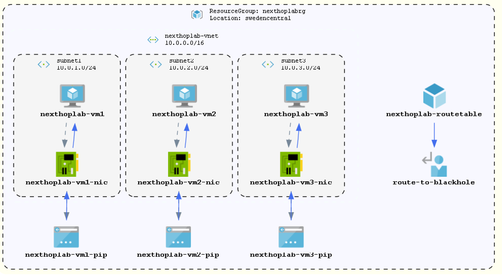

# Next Hop Troubleshooting Lab

This guide provides step-by-step instructions to troubleshoot routing issues using Azure Network Watcher's Next Hop tool.

## Lab Architecture Overview

- Virtual Network with multiple subnets
- Two Ubuntu VMs in different subnets
- Custom route table with a problematic route
- Network Watcher enabled to troubleshoot routing issues



---

## Step 1: Deploy the Lab Environment

Open **Azure CLI** or **PowerShell** with the Azure module installed.

---

### Create a New Resource Group:

#### PowerShell

```powershell
New-AzResourceGroup -Name 'nexthoplab-rg' -Location 'swedencentral'
```

#### Azure CLI

```bash
az group create --name 'nexthoplab-rg' --location 'swedencentral'
```

---

### Deploy the Bicep Template:

#### PowerShell

```powershell
New-AzResourceGroupDeployment -ResourceGroupName 'nexthoplab-rg' -TemplateFile 'nexthop-troubleshooting-lab.bicep' -adminUsername 'azureadmin'
```

#### Azure CLI

```bash
az deployment group create --resource-group 'nexthoplab-rg' --template-file 'nexthop-troubleshooting-lab.bicep' --parameters adminUsername='azureadmin'
```

#### Azure Cloud Shell (if you do not have installed any tools)

1. Sign in to the `Azure Portal`.
2. Open `Cloud Shell` by clicking the terminal icon in the top navigation bar.
3. Select either `Bash` or `PowerShell` environment.
4. Upload your Bicep file using the `Upload/Download files` option.
5. Deploy using the commands like above.

> **Note:** The output values (VM names, IPs) will be required for the next steps.

---

## Step 2: Verify the Routing Issue

1. Connect to **VM2** (in Subnet2) using **SSH** or the **Serial Console** in the Azure Portal.
2. Try to ping **VM3** (in Subnet3):

   ```bash
   ping <vm3-private-ip>
   ```

   > **Expected Result:** The ping should fail due to the custom route table applied to Subnet2 that routes traffic to Subnet3 (`10.0.3.0/24`) to a "black hole" (next hop type: None).

3. Connect to **VM1** (in Subnet1) and try the same ping to **VM3**:

   ```bash
   ping <vm3-private-ip>
   ```

   > **Expected Result:** This ping should succeed because VM1 is in Subnet1, which doesn't have the problematic route table applied.

---

## Step 3: Use Next Hop Tool to Diagnose the Issue

1. In the Azure portal, navigate to **Network Watcher**.
2. Under **Network diagnostic tools**, select **Next hop**.
3. Configure the Next hop parameters:

   - **Subscription:** Select your subscription.
   - **Resource Group:** `nexthoplab-rg`.
   - **VM:** Select `vm2`.
   - **Network Interface:** Select `vm2`'s NIC.
   - **Source IP address:** Use the private IP of VM2 (auto-populated).
   - **Destination IP address:** Enter VM3's private IP.

4. Click **Run**.

### Review the Results:

- You should see the next hop type is **"None"**.
- This indicates traffic is being dropped due to a custom route.
- The tool will identify the route table that's causing the issue (`nexthoplab-routetable`).

---

## Step 4: Examine the Effective Routes

1. In the Azure portal, navigate to **Virtual Machines > nexthoplab-vm2 > Networking**.
2. Click on the network interface for **VM2**.
3. In the left menu, select **Effective routes**.

### Review the Routes:

- You'll see the custom route for `10.0.3.0/24` with next hop type **"None"**.
- This confirms the route table is blocking traffic to Subnet3.

---

## Step 5: Verify the Route Table Configuration

1. In the Azure portal, navigate to **Route tables > nexthoplab-routetable**.
2. Review the routes:
   - There should be a route named **"route-to-blackhole"**.
   - It has address prefix `10.0.3.0/24` and next hop type **"None"**.

> **Note:** This configuration drops all traffic destined for Subnet3.

---

## Step 6: Resolve the Routing Issue

1. Navigate to the route table in the Azure portal:
   - **Route tables > nexthoplab-routetable**.
2. Select **Routes** and then select the **"route-to-blackhole"** route.
3. Perform one of the following actions:

   - **Delete the route:** Click **Delete** to remove the problematic route.
   - **Modify the route:** Select the route and click **Edit**. Change **Next hop type** to **"Virtual network"** and save the changes.

4. Connect to **VM2** again and test connectivity to **VM3**:

   ```bash
   ping <vm3-private-ip>
   ```

   > **Expected Result:** The ping should now succeed, indicating the routing issue has been resolved.

---

## Step 7: Verify with Next Hop Tool (After Fix)

1. Return to **Network Watcher > Next hop**.
2. Run the Next hop check again with the same parameters:
   - **VM:** `vm2`.
   - **Destination IP:** VM3's private IP.

### Review the Updated Results:

- You should now see the next hop type is **"VirtualNetwork"**.
- This confirms the routing issue has been fixed.

---

## Step 8: Clean Up Resources

To avoid unnecessary costs, delete the resource group and all associated resources once you are done with the lab.

#### PowerShell

```powershell
Remove-AzResourceGroup -Name 'nexthoplab-rg' -Force
```

#### Azure CLI

```bash
az group delete --name 'nexthoplab-rg' --yes --no-wait
```

> **Note:** Ensure you no longer need the resources before running the above commands.

---

## Troubleshooting Workflow Summary

1. **Identify the issue:** Determine that VM2 cannot connect to VM3.
2. **Verify connectivity:** Confirm the issue by attempting to connect from VM2 to VM3.
3. **Use Next Hop tool:** Determine the next hop type and identify any routing issues.
4. **Check effective routes:** Examine all routes applied to the VM to understand the full routing configuration.
5. **Modify route table:** Update or remove problematic routes.
6. **Verify resolution:** Test connectivity again and use Next Hop to confirm the issue is resolved.
