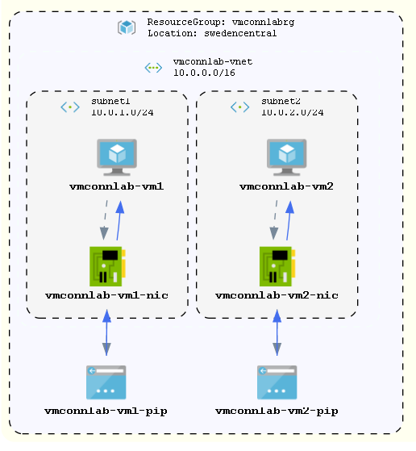

# VM-to-VM Connectivity Troubleshooting Lab

This guide provides detailed instructions to set up a lab environment where you can practice troubleshooting VM-to-VM connectivity issues using Azure Network Watcher's IP Flow Verify and NSG Diagnostics tools.

## Lab Architecture Overview

- Virtual Network with two subnets
- Two Ubuntu VMs (one in each subnet)
- Network Security Groups with rules explicitly blocking traffic between VMs
- Network Watcher enabled in the region



# Step 1: Deploy the Lab Environment

Open **Azure CLI** or **PowerShell** with the Azure module installed.

---

### Create a New Resource Group:

#### PowerShell

```powershell
New-AzResourceGroup -Name 'vmconnlab-rg' -Location 'swedencentral'
```

#### Azure CLI

```bash
az group create --name 'vmconnlab-rg' --location 'swedencentral'
```

---

### Deploy the Bicep Template:

#### PowerShell

```powershell
New-AzResourceGroupDeployment -ResourceGroupName 'vmconnlab-rg' -TemplateFile '.\demos\network-monitoring-troubleshooting\vm-connectivity-lab\vm-connectivity-lab.bicep' -adminUsername 'azureadmin'
```

#### Azure CLI

```bash
az deployment group create --resource-group 'vmconnlab-rg' --template-file '.\demos\network-monitoring-troubleshooting\vm-connectivity-lab\vm-connectivity-lab.bicep' --parameters adminUsername='azureadmin'
```

#### Azure Cloud Shell (if you do not have installed any tools)

1. Sign in to the `Azure Portal`.
2. Open `Cloud Shell` by clicking the terminal icon in the top navigation bar.
3. Select either `Bash` or `PowerShell` environment.
4. Upload your Bicep file using the `Upload/Download files` option.
5. Deploy using the built-in commands like above.

> **Note:** The output values (VM names, IPs, NIC names) will be required for the next steps.

---

# Step 2: Verify the Connectivity Issue

Connect to **VM1** using **SSH** or the **Serial Console** in the Azure Portal.

Try to ping **VM2** (this should fail due to the NSG rule):

```bash
ping <vm2-private-ip>
```

> **Expected Result:** The ping should fail due to the NSG rule blocking outbound traffic from `subnet1` to `subnet2`.

---

# Step 3: Troubleshoot Using IP Flow Verify

1. In the Azure portal, navigate to **Network Watcher**.
2. Under **Network diagnostic tools**, select **IP flow verify**.
3. Configure the IP flow verify parameters:

   - **Subscription:** Select your subscription.
   - **Resource Group:** `vmconnlab-rg`.
   - **VM:** Select `vm1`.
   - **Network Interface:** Select `vm1`'s NIC.
   - **Traffic Direction:** Outbound.
   - **Protocol:** TCP.
   - **Local IP:** Use the private IP of VM1 (auto-populated).
   - **Local Port:** `56789` (for TCP).
   - **Remote IP:** Enter VM2's private IP.
   - **Remote Port:** `22` (for SSH) or `80` (for HTTP).

4. Click **Check**.

### Review the Results:

- You should see an **"Access denied"** message.
- The message will identify the NSG rule that's blocking the traffic (e.g., `"block-vm2"`).
- The tool will show which NSG (subnet-level or NIC-level) contains the blocking rule.

---

# Step 4: Examine NSG Rules with NSG Diagnostics

1. In **Network Watcher**, select **NSG diagnostics** under **Network diagnostic tools**.
2. Configure the diagnostics parameters:

   - **Subscription:** Select your subscription.
   - **Resource Group:** `vmconnlab-rg`.
   - **VM:** Select `vm1`.
   - **Network Interface:** Select `vm1`'s NIC.
   - **Traffic Direction:** Outbound.
   - **Protocol:** TCP (or ICMP).
   - **Source IP Address:** VM1's private IP.
   - **Destination IP Address:** VM2's private IP.
   - **Destination Port:** `22` (or other port you're testing).

3. Click **Run diagnostics**.

### Review the Effective Security Rules:

- The tool will display all security rules affecting the VM.
- It will highlight which rule is blocking the traffic.
- You'll see details about the NSG, its association level (subnet or NIC), and the rule's priority.

---

# Step 5: Resolve the Connectivity Issue

1. Locate the NSG with the blocking rule (e.g., `nsg1`).
2. Navigate to the NSG in the Azure portal:

   - **Resource Groups > vmconnlab-rg > vmconnlab-nsg1**.

3. Remove or modify the blocking rule:
   - Select **Outbound security rules**.
   - Find the rule named `"block-vm2"`.
   - Either delete the rule or modify it to allow traffic.

### Alternative: Add a New Rule with Higher Priority

1. Click **Add** to create a new outbound rule.
2. Configure the rule:

   - **Priority:** Set a lower number than `200` (e.g., `150`).
   - **Action:** Set to **Allow**.
   - **Source:** Subnet1.
   - **Destination:** Subnet2.

3. Save the rule.

---

### Test Connectivity Again:

From **VM1**, try to connect to **VM2** to confirm the issue is resolved.

---

# Step 6: Clean Up Resources

To avoid unnecessary costs, delete the resource group and all associated resources once you are done with the lab.

#### PowerShell

```powershell
Remove-AzResourceGroup -Name 'vmconnlab-rg' -Force
```

#### Azure CLI

```bash
az group delete --name 'vmconnlab-rg' --yes --no-wait
```

> **Note:** Ensure you no longer need the resources before running the above commands.

### Troubleshooting Workflow Summary

1. **Identify the issue**: Determine that VM1 cannot connect to VM2
2. **Verify connectivity**: Confirm the issue by attempting to connect from VM1 to VM2
3. **Use IP Flow Verify**: Determine if an NSG rule is blocking traffic and identify which one
4. **Use NSG Diagnostics**: Examine all effective NSG rules to understand the full security configuration
5. **Modify NSG rules**: Update or create rules to allow the necessary traffic
6. **Verify resolution**: Test connectivity again to confirm the issue is resolved
